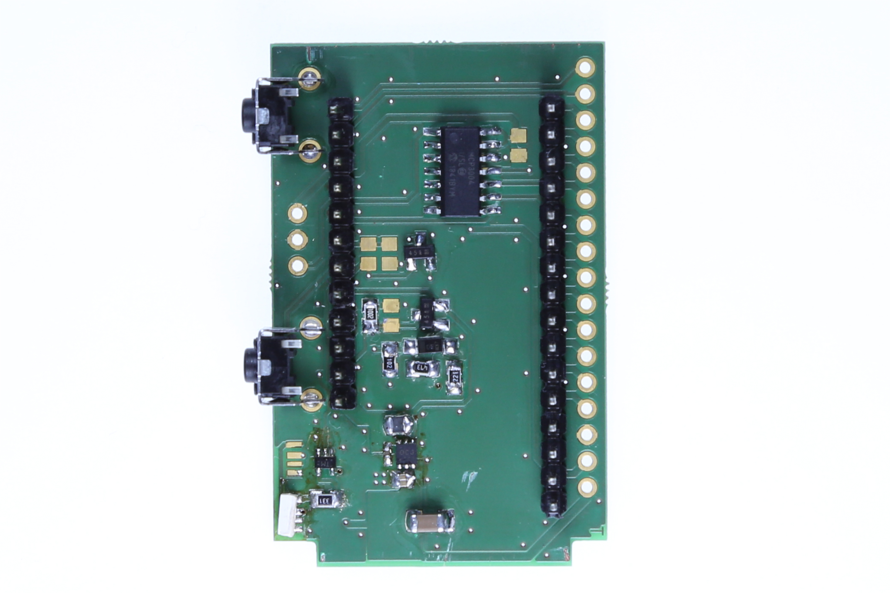
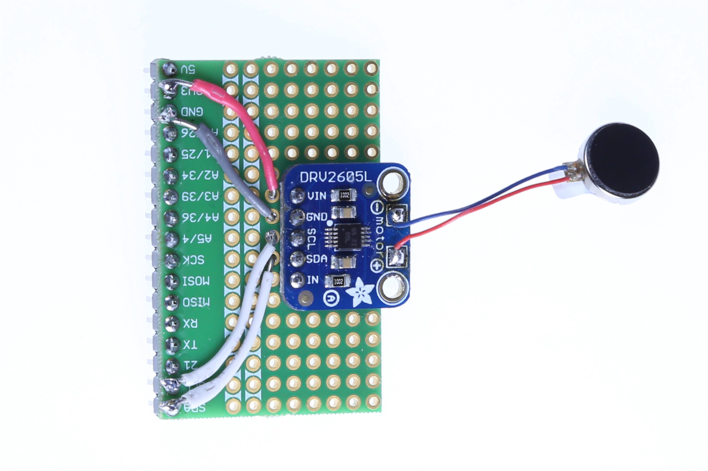
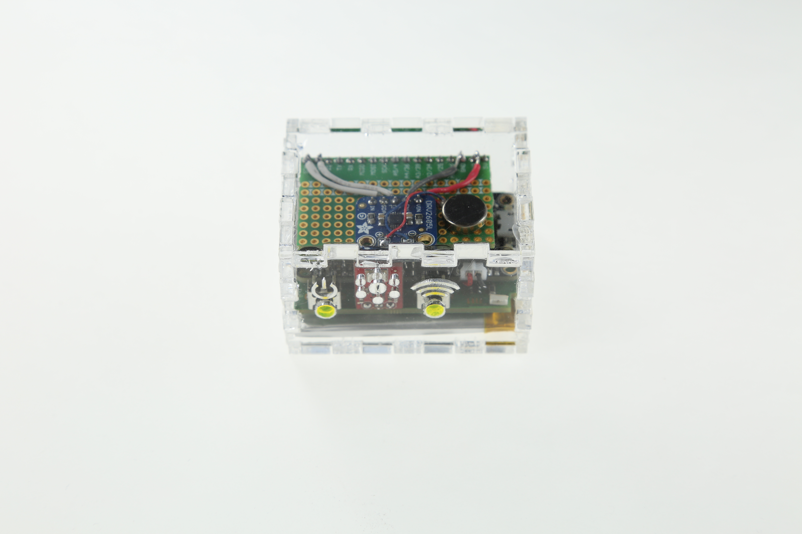

# cBlocks


cBlocks is a tool that empowers non-experts such as designers or electronics beginners to prototype the Internet of Things (IoT). Prototyping early ideas in the context of the Internet of Things is difficult. Building functional prototypes requires
advanced knowledge in technologies like Internet connectivity, sensor hardware and low level programming. At the same time evaluating the user experience of early concepts is extreme valuable because best practices in design are missing for this emerging and rather unexplored design space. With our system we provide a rapid prototyping tool for Internet of Things applications that is tailored to the needs of non-expert users. We encapsulate hardware details and facilitate easy Internet connections. At the same time our system is open source and therefore ready to be used and extended by the DIY community.

The system design follows the following **design principles**:

- Plug & Play: No configuration, instant feedback.
- Hardware Abstraction: Act on physical instead of electrical values.
- Grow As You Go: Logic can be programmed on various levels of complexity. Users withoaut knowledge in programming can use IFTTT to programm cBlocks. Users with programming experience can read and control cBlocks directly via MQTT.
- Internet Connectivity: Intuitive pairing mechanism between cBlocks and bridge.
- Open Everything: New sensors or actuators can be added; external IoT products can be connected; built on an open hardware platform.

Anyone with making knowledge in electronics and programming can build their own cBlocks and provide it to the community. At the top of the page are two example cBlocks, a vibration cBlock (left) and a button cBlock (right). There are no restrictions, e.g. we also build a kitchen scale cBlock. You are only limited by your imagination! 

This document is a step-by-step workshop to get started with cBlocks. The first part explains how to create a cBlock and set up the infrastructure to get going. The second part describes how the previously built cBlock can be used. As an example, we will implement a vibration cBlock, that can be controlled via the UI or MQTT.

## Make Them

In this section we will explain how to build a vibration motor cBlock and how to set up the infrastructure to get started.

### Architecture

First of all lets introduce the cBlocks architecture. This will help you in understanding the individual building blocks of the system.


#### cBlocks
These are the core building blocks used to sense and control the physical world. E.g. a temperature sensor, a button or a vibration motor.

#### Visualizer
The Visualizer is a web application meant to display sensor data and control the cBlock actuators. It reads meta data
from the backend in order to detect which cBlocks are online and it receives current sensor readings via MQTT. The
state of a cBlock is visualized by user interface controls that depend on the data to be visualized or controlled. Furthermore, there is a data mapping feature. This way a user can attach semantic meaning to generic sensor readings; e. g. certain temperature ranges could be mapped to Cold and Hot, which allows for a more natural language.

#### Bridge
In order to connect cBlocks to the Internet we provide the Bridge component, which is currently implemented using a
Raspberry Pi 3. The Bridge is connected to the Internet through an Ethernet cable and communicates with the individual cBlocks via Wi-Fi (IEEE 802.11n). The Bridge allows for minimal configuration effort since it offers a pairing mechanism for local cBlocks. Network credentials are exchanged between the Bridge and cBlocks in order to connect the cBlocks with the network. An [audio protocol](https://github.com/weckbach/AstroMech) has been developed to broadcast the credentials to all nearby cBlocks.

#### Backend
The Backend is responsible for command/response handling, providing meta data about the cBlocks and semantic
mappings of readings and commands. Command/response handling is necessary because the MQTT protocol does not
provide any request/response model off the shelf. For instance, if the Visualizer sends a “turn off” command to the
RGB-LED, the Backend must check if the request has the correct format and respond with a timeout error message if the cBlock does not react timely. The Backend also provides meta data about the specific cBlocks. For example, the Visualizer reads which resources a cBlock provides, as well as which data type and units those resources use, in order to display them correctly. The temperature and humidity sensor for instance, has two numerical resources Temperature and Relative Humidity.

#### MQTT broker
The MQTT broker is used as a message bus, exchanging real-time sensor readings and actuator commands to and from the cBlocks. The MQTT Broker provides the means to connect any third-party software to the system, since it is an established standard in the IoT field.

### Make a cBlock 

Now, let's actually make our first cBlock.

#### Hardware

##### cBlocks Board
In order to get started with cBlocks we first have to build the board. The cBlocks board is based on the [Adafruit Feather HUZZAH32 Dev Board](https://learn.adafruit.com/adafruit-huzzah32-esp32-feather/overview). This is an excellent dev board since it has lots of handy features like the battery charger or the USB to serial converter. Since cBlocks needs some more functionalities like a microphone for pairing, a 5V booster, a status LED and some Buttons, we designed our board around the HUZZAH32. It can be understood as a breakout of the breakout. You can find the schematics and the layout [here](https://github.com/informatik-mannheim/cblocks-arduino-sdk/tree/master/schematics). Please order the board at your favorite PCB manufacturer. You can also export the parts list via Eagle and order the parts at your favorite store. Additionally you'll need the following parts:
- A microphone. We use the [MEMS microphone](https://www.sparkfun.com/products/9868) from SparkFun. 
- The Adafruit Feather HUZZAH32 itself. 
- A LiPo battery. We use this [1000mAH battery](https://www.exp-tech.de/zubehoer/batterien-akkus/lipo-akkus/5801/lipo-akku-1000mah-3.7-v-2-mm-jst), because it fits well inside our casing.

Once you have the board and all the parts you can start soldering it. The soldering can be pretty tough because it includes small SMDs, so you should have some advanced soldering skills.

Here is how the cBlocks board looks withouth the ESP32.  Next, here is how it looks like with the ESP32 soldered on top of it. 


#### cBlocks Protoboard
In addition to the cBlock board there is also an optional cBlocks protoboard. It is a shield stacked on top of the cBlock board that has some labeled pin outs. It makes prototyping new cBlocks easier, so feel free to order that board as well.

#### Vibration Motor Circuit
For the vibration motor circuit you will need the [Vibrating Mini Motor Disc](https://www.adafruit.com/product/1201) and the [Adafruit DRV2605L Haptic Controller Breakout](https://learn.adafruit.com/adafruit-drv2605-haptic-controller-breakout/overview). Feel free to use any other vibration motor. The hook up is straight forward:

| Protoboard        | DRV2605L           |
| ------------- |:-------------:|
| SDA      |SDA|
| SCL     |SCL|
| 3V3 | VIN|
| GND | GND|

The proto hat with the vibration circuit on it looks like this: 

#### Casing (optional)

This step is optional, but gives your cBlock a more finished look. We use a laser cutter to do the casing. Here is the corresponding [SVG file](https://github.com/informatik-mannheim/cblocks-vibration-motor/blob/master/caseplans.svg) for the vibration motor.

Finally, the fully assembled cBlock looks as follows: 

#### Arduino SDK

Lets bring the cBlock to live! We developed a cBlocks [Arduino SDK](https://github.com/informatik-mannheim/cblocks-arduino-sdk) thats makes the development of cBlocks as easy as developing Arduino sketches. The Arduino SDK can only be used via [Platform IO](https://platformio.org/). It is an IDE for developing embedded systems. We use it because it has a proper dependency management system and the cBlocks IDE has quite a few dependencies. There are extensions for Visual Studio Code and Atom. After you installed Platform IO, please clone our sample code via:

`git clone git@github.com:informatik-mannheim/cblocks-vibration-motor.git && cd cblocks-vibration-motor`

If you installed Platfrom IO on the CLI you can run `pio run -t upload` to upload the code to the cBlock. Otherwise follow the instructions for your IDE to upload the code. The cBlock won't work yet, because it needs at least the Bridge component to function.

### Bridge
The cBlocks Bridge has several functions:
- Wireless Access Point
- Gateway to the Internet
- MQTT-Bridge
- Provides pairing mechanism that makes configuration of cBlocks super easy

#### Hardware
The heart of the Bridge is a [Raspberry Pi 3 Model B](https://www.raspberrypi.org/products/raspberry-pi-3-model-b/). It has Ethernet and WiFi and can be used as a low budget Wireless Access Point with [Eclipse Kura](https://www.eclipse.org/kura/). For the Audio Pairing you need an active speaker and a momentary push button. We wrote an audio broadcast protocol called [AstroMech](https://github.com/weckbach/AstroMech) for cBlocks. 


#### Install Raspbian via NOOBS

Please refer to this official [guide](https://www.raspberrypi.org/documentation/installation/noobs.md) on how to install Raspbian 4.14 via NOOBS. 

### Install Kura 4.0.0

Please follow this guide to install Eclipse Kura https://eclipse.github.io/kura/intro/raspberry-pi-quick-start.html. This will turn the Raspberry Pi into a WiFi Access Point.

#### Network configuration

Once Kura is up and running the firewall and wlan settings has to be changed. Since the bridge hosts a MQTT bridge we have to open TCP ports 1883 and 1884. Open the Kura UI via the browser http://172.16.1.1/kura. The credentials are "admin:admin". Under *firewall* add an entry "1883:1884" for TCP.

Now it is time to configure the WiFi. Under `Ǹetwork -> wlan0 -> Wireless` set the Network Name to "cblocks-gateway" and also choose a password. Hit "apply" to apply the changes. Connect to the new WiFi Access Point with your PC.

Next we have to configure the MQTT Bridge. Run `nano /etc/mosquitto/conf.d/cblocks.conf` and paste the following:

```
connection bridge-01
address <broker-ip>:1883

topic # both 0

listener 1883
listener 1884
protocol websockets
```

Since we will use our desktop machine to host the backend, replace `<broker-ip>` with the IP of your machine. In linux systems you can find your IP adress by running `ifconfig`. Restart mosquitto by running `sudo service mosquitto restart`. Note in a production environment the Backend would be hosted on a public accessible server in the Internet.

#### Set up pairing

Connect an active speaker to the cinch connector of your raspberry pi. Also connect a momentary push button to GPIO 14 and GND of the Pi. To install the pairing script run the following on the console:

```
cd && mkdir cblocks && cd cblocks
wget https://raw.githubusercontent.com/weckbach/AstroMech/master/RaspberryPi/main.py
sudo apt install sox
pip install reedsolo

python pairing.py "cblocks-gateway;<password>"
```

Now when pressing the push button, the speaker should emit a sound, encoding the WiFi credentials.

### Backend

In this part we will set up the backend on your local desktop computer. Since the backend is completely dockerized, you should first intall [Docker](https://www.docker.com/). Clone the backend repo via `git clone git@github.com:informatik-mannheim/cblocks-backend.git && cd cblocks-backend`. Copy or symlink the docker-compose config via `cp docker-compose.example.yml docker-compose.yml` or  `ln -s docker-compose.example.yml docker-compose.yml`. The compose file includes MongoDB for storing the data and Apache Mosquitto as the MQTT broker. Simply run `docker-compose up` (optionally -d to run in background") to start the backend and all the services needed.

Since the Pi bridges all the MQTT traffic to your local MQTT broker you should see all the messages by running `mosquitto_sub -t '#' -v`. At this point no messages should occur, since the cBlock is not yet connected to the WiFi.

Run `docker-compose exec app node src/mongo_bootstrap.js` to create all registry entries. Thus the Visualizer can get all the meta data about the vibration motor cBlock.

### Visualizer

To install the visualization component of cBlocks follow the instructions in the [Visualizer repository](https://github.com/informatik-mannheim/cblocks-visualizer). After completing the installation process open the Visualizer in your browser. If everything went right you will see a page with a headerbar and an empty dark dashboard. Now you will need to configure the endpoints the Visualizer is supposed to talk to.

Click on the hamburger menu in the top left corner and choose 'Urls'. Enter the appropriate URLs in the two fields and click 'SET URLS'. The Visualizer is now ready to go.

## Usage

In this section we will actually use our new cBlock by controlling it via the Visualizer. Using the cBlock will involve the following steps:

1. Turn on the cBlock
2. Pair the cBlock
3. Control it via the Visualizer / MQTT

You can turn on the cBlock by pressing the left push button on the board (if the LED does not turn on, try holding the power button a little longer). The cBlock will now turn on and attempt to connect to the network. Since no credentials are provided yet, the LED will turn red, indicating that connecting failed. Press the right button to put the cBlock into pairing mode. The LED should turn blue. Now hold the microphone of the cBlock in front of the speaker of the Bridge (Raspberry Pi). Emit the pairing sound by pressing the push button connected to the Raspberry Pi. After pairing the LED should turn yellow (connecting) and then green (connected). 

Once the cBlock is connected to the Bridge it will automatically be displayed on the Visualizer. A physical cBlock is visually represented by a floating card. In the screenshot below you can see the Visualizer while two cBlocks are turned on and connected. 

Alternatively you can read sensor data and control cBlocks via MQTT. The topic structure is described [here](https://github.com/informatik-mannheim/cblocks-backend/wiki/Real-time). Run `mosquitto_pub -t 'myClient/3307/0/0/input' -m '{"data": 100}'` to turn the motor to 100%.
